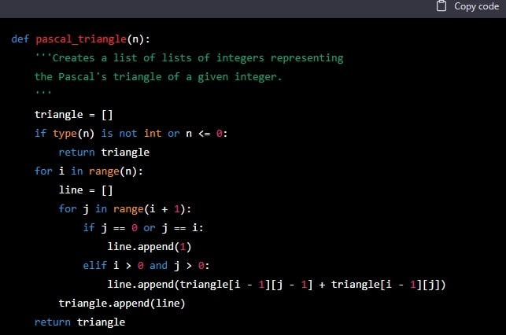

# Pascal's Triangle

This project contains tasks for working module with Pascal's triangle as a challenge.

## Tasks

+ [x] 0. **Pascal's Triangle** [0-pascal_triangle.py](0-pascal_triangle.py) contains a function `def pascal_triangle(n):` that returns a list of lists of integers representing the Pascal's triangle of `n`:
  + Returns an empty list if `n <= 0`.
  + You can assume `n` will be always an integer.

This function appears to generate the rows of Pascal's triangle up to a given integer n.

Pascal's triangle is a triangular array of integers that can be constructed by following a simple rule: the value at any position in the triangle is the sum of the two values immediately above it. The first row is always [1], and subsequent rows are generated by adding the two values immediately above and to the left and right of each position in the previous row.

This function takes an integer n as input and returns a list of lists of integers representing the Pascal's triangle with n rows. If n is not a positive integer, the function returns an empty list. The function generates each row of the triangle by iterating through the values in that row and either appending a 1 (if it's the first or last value in the row), or the sum of the two values above it in the previous row (if it's any other value).
